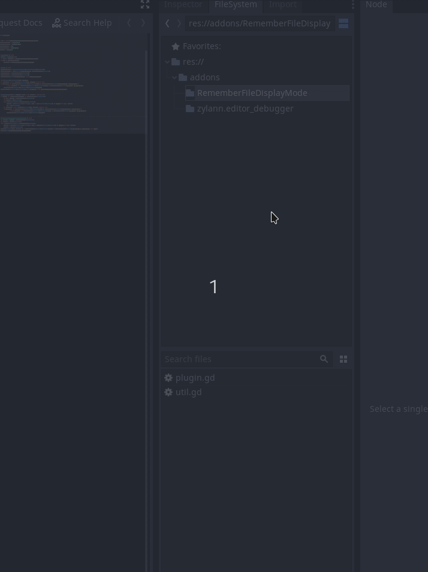

# A Godot Plugin RememberFileDisplayMode

Directories remember their display mode (list or thumbnail) in the split view of the FileSystem dock. The default is the list view.

**Installation:**

Either download it from the official Godot AssetLib (within Godot itself) or download the addons folder from here and move it to the root (res://) of your project. Enable the plugin in the project settings.

**Preview**

